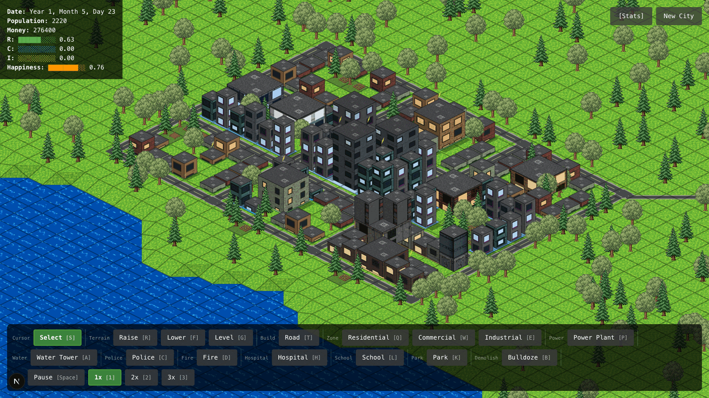

# Cimulity

[](http://zeikar.dev/hyperclaude/)

**Open-source minimal city simulation game in the browser.**

Cimulity is a SimCity-style city builder built with Next.js, TypeScript, and PixiJS. It focuses on a small, readable simulation core: isometric terrain, roads, zoning, basic growth/economy, and terrain editing.



## Project Status

MVP-1 is playable and in active development. The current build supports:
- 64x64 isometric terrain with camera pan/zoom, hover/select, and drag previews
- Roads, bulldoze, R/C/I zoning, and raise/lower/level terrain tools
- Vertex-based terrain with smooth slopes, elevation-derived water, and coplanar road/zone placement
- Fixed-timestep simulation with zone growth, population, money, speed/pause controls, autosave, and New City reset
- Power plants + binary reachability gate zone growth
- Water towers gate zone level-ups/density (power gates initial spawn)
- Police, fire, hospital, and school stations provide road-network coverage; level-up now requires all four at the anchor
- Land value gates level-up at the anchor: road proximity (weight 0.40), zone-mix diversity (0.10), service coverage (0.50 — avg of the four), plus additive park proximity (+0.25 max); park is a separate amenity, not a fifth coverage service

Next focus: replace placeholder colored geometry with sprites/textures, add more terrain variety, and continue tightening tool feedback.

## Getting Started

```bash
# Install dependencies
npm install

# Run development server
npm run dev
```

Open [http://localhost:3000](http://localhost:3000) to play!

### Controls
- **Pan**: Move cursor to any screen edge to scroll (speed scales with proximity to edge)
- **Zoom**: Mouse wheel (zooms around cursor)
- **Select Tile**: Left-click on any tile
- **Hover**: Move mouse over tiles to see highlight
- **Tools**: S select, T road, B bulldoze, Q/W/E residential/commercial/industrial zones, P power plant, A water tower, C police station, D fire station, H hospital, L school, K park
- **Terrain**: R raise, F lower, G level/flatten
- **Time**: Space pause/resume, 1/2/3 speed

## Tech Stack

- **Framework**: Next.js 16.1.1 (App Router)
- **Language**: TypeScript (strict mode)
- **Rendering**: PixiJS 8.15.0 (WebGL with Canvas fallback)
- **Styling**: Tailwind CSS 4
- **Testing**: Vitest

## Architecture

Layered: input emits tile coords + active tool; engine (`CommandDispatcher`) calls pure tool helpers to build commands, then writes to core; render reads core. React is the shell.

See [docs/architecture.md](docs/architecture.md) for the full layer diagram, directory structure, coordinate math, and camera/picking details. Per-subsystem deep dives will live under `docs/systems/` as they land.

## Roadmap

### MVP-1 (Remaining)

- [ ] **Expanded tile types** - Additional terrain variety (water is derived from elevation — sea-level tiles render as water by default)
- [ ] **Sprites/textures** - Replace colored shapes with actual graphics

### MVP-2 (Future)

- [x] **Services** - Police, fire, hospital, and school coverage all shipped (road-network + distance falloff); the coverage family has four members (police/fire/hospital emergency trio + school education); level-up gates on all four at the anchor
- [x] **Parks** - Park tile shipped (forest-green, keyboard K, cost 100); raises nearby land value (Chebyshev radius 4, additive +0.25 max, nearest-park strongest-wins); park is a land-value amenity — it is NOT a fifth coverage service (the four-input formula is road 0.40 + diversity 0.10 + service 0.50, plus the additive park +0.25)
- [ ] **Happiness/statistics** - Citizen happiness, budget charts
- [ ] **Sound effects** - Audio feedback
- [x] **Land-value model** - Road weight rebalanced 0.7→0.40, diversity 0.3→0.10; the four coverage services now contribute a combined service term (weight 0.50, average of the four normalised coverages) atop the additive park bonus (+0.25). Services play a dual role: hard-gate level-up at the anchor AND feed land value.

## Contributing

This is a learning/demonstration project. Feel free to fork and experiment!

### Code Style

- **TypeScript strict mode** enabled
- **Functional approach** where possible
- **Immutable data** in core layer (future)
- **Clean separation** of concerns
- **No circular dependencies** between layers

## License

MIT (or your preferred license)

---

**Built with [HyperClaude](http://zeikar.dev/hyperclaude/)** — *Claude builds, Codex critiques.* My own Claude Code plugin. 🤖✨
